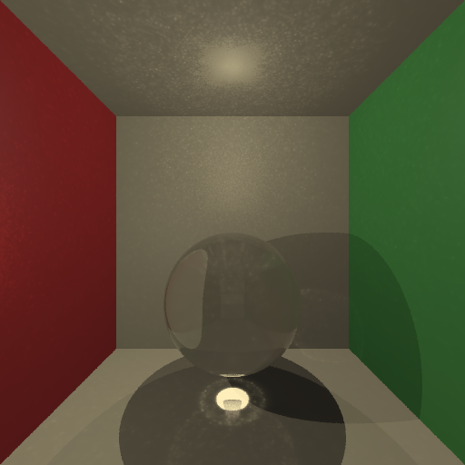
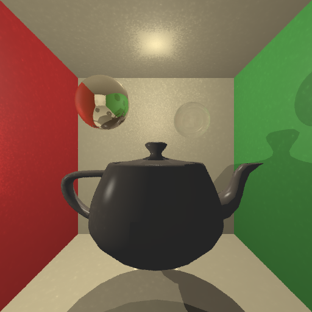

# Ray Tracer with Photon Mapping

A classic Whitted-style ray tracer with global illumination via photon mapping, written in C++.

It outputs a scene to a PPM image in the images folder, which can be converted to a viewable PNG via your terminal using ImageMagick or a website like [convertio](https://convertio.co/).

## Example Images





## How it works


## Features

- Whitted Ray Tracing
- Spheres and Polymesh objects
- Point lights
- Shadows
- Transparent and reflective materials
- Phong shading
- Photon mapping (global and caustic) using kd-trees and k-NN searches
- Multi-object scenes
- Antialiasing
- Gamma correction

## Installation and Running the Path Tracer

### Installation
#### Mac

```
git clone https://github.com/CarolineMillan/raytracer_cpp.git
cd raytracer_cpp
chmod +x Scripts/Setup-Mac.sh
./Scripts/Setup-Mac.sh
```

You will be prompted for your password to install raytrace to ```/usr/local/bin```.

#### Linux

```
git clone https://github.com/CarolineMillan/raytracer_cpp.git
cd raytracer_cpp
chmod +x Scripts/Setup-Linux.sh
./Scripts/Setup-Linux.sh
```

You will be prompted for your password to install raytrace to ```/usr/local/bin```.

#### Windows

```
git clone https://github.com/CarolineMillan/raytracer_cpp.git
cd raytracer_cpp
Scripts\Setup-Windows.bat
```


Requires `make` to be available first — install via [Git for Windows](https://gitforwindows.org/), [MSYS2](https://www.msys2.org/), or Chocolatey (`choco install make`). After running the script, `grape.exe` will be copied to `C:\Windows\System32`.

NB: I don't have a Windows machine to test this on, so please let me know if it doesn't work.

### Running

The raytracer must be run from the project root so that it can find the mesh files:

```
cd raytracer_cpp
raytrace
```

The output will be saved as a ```.ppm``` file in the ```images/``` folder. To convert to ```.png```, use [ImageMagick](https://imagemagick.org/#gsc.tab=0):

```magick images/<filename>.ppm output.png```

or upload the ```.ppm``` to [convertio](https://convertio.co/).

## Acknowledgements

- My lecturer Ken Cameron provided the base code that I worked off for this project, and I've left his comments in 
- I used [The Cherno's project template](https://github.com/TheCherno/ProjectTemplate) to structure the project
- kdtree.h was AI-assisted, the rest is my own work

## Licence

## Future Plans:

- [ ] Importance sampling (currently hard coded)
    - [ ] Caustic photons
    - [ ] Indirect global photons
- [ ] A CLI
- [ ] Store photon maps between renders
- [ ] Add some features from Peter Shirley's ray tracing in one weekend
    - [ ] BVH
    - [ ] area lights
    - [ ] perlin noise
    - [ ] improve camera model
- [ ] Sort ```use namespace std``` and ```pragma once```  and ```#ifndef```statements
